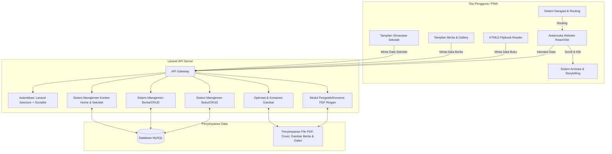
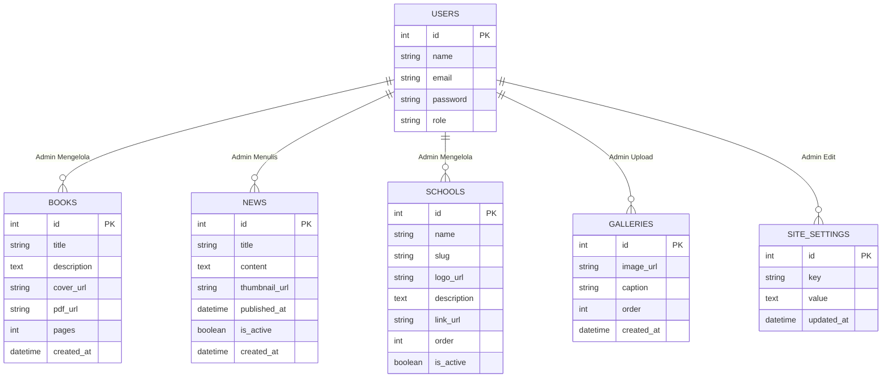

# PRD — Project Requirements Document

## 1. Overview
Aplikasi ini adalah website resmi untuk **Yayasan Pendidikan Metland**. Tujuan utamanya adalah membangun kehadiran digital yang profesional, formal, namun sangat interaktif seperti sedang "bercerita" (storytelling) kepada pengunjung. Website ini menjadi pusat informasi terpusat yang menaungi berbagai unit sekolah di bawah yayasan.

Selain sebagai profil yayasan, website ini berfungsi sebagai platform **Web Literasi** canggih dan pusat informasi terkini. Fitur andalannya adalah e-library di mana dokumen PDF dapat dikonversi dan dibaca layaknya buku fisik interaktif (HTML5 Flipbook), serta bagian **Berita & Artikel Yayasan** yang dinamis. Sistem ini dirancang khusus agar proses membaca, browsing berita, dan navigasi antar unit sekolah (TK, SD, SMK, College) sangat mulus, ringan (lightweight), dan memiliki sistem manajemen (CRUD) di mana Admin dapat menambah, menghapus, atau mengatur koleksi buku, berita, galeri, dan data sekolah dengan mudah dan tanpa celah (error-free).

## 2. Requirements
- **Desain & Identitas:** Tampilan formal yang secara instan memberitahu pengunjung bahwa ini adalah institusi pendidikan bonafide, digabungkan dengan animasi tingkat tinggi (High Interactive) yang memandu visual pengunjung.
- **Struktur Navigasi:** Website harus memiliki menu navigasi utama yang jelas mencakup: Home, Profil, Our School, Artikel, dan Literasi, dengan submenu yang responsif.
- **Performa Platform (Lightweight & Responsive):** Dibangun sebagai Hybrid PWA (Progressive Web App) dengan optimasi aset maksimal. Website harus ringan (loading speed < 3 detik), hemat kuota, dan responsif sempurna di semua device (Mobile-first & Desktop).
- **Konversi PDF & Aset Gambar Optimized:** Proses render PDF ke HTML5 dan tampilan gambar berita/galeri harus menggunakan teknik kompresi dan lazy-loading agar tidak membebani memori perangkat user.
- **Keamanan & Akses:** Sistem harus memiliki akses Login menggunakan Email/Password dan Google (OAuth) khusus untuk Admin.
- **Infrastruktur Terpusat:** Di-deploy (di-hosting) secara penuh menggunakan ekosistem Vercel (Frontend) dan Server Laravel (Backend) untuk memastikan akses yang cepat dan stabil di seluruh internet.

## 3. Core Features
- **Interactive Storytelling Homepage:** Halaman beranda dengan animasi berbasis gulir (scroll-animations) yang mencakup struktur khusus:
  1. **Galeri Kegiatan:** Visual dinamis slideshow kegiatan yayasan.
  2. **Sambutan Ketua Yayasan:** Bagian storytelling teks/video singkat dari Ketua Yayasan.
  3. **Showcase Unit Sekolah:** Grid/Slider interaktif untuk akses cepat ke semua sekolah (TK, SD, SMK, College).
  4. **Highlight Berita Terbaru:** Menampilkan artikel terbaru secara dinamis.
- **Navigasi Multi-Level:**
  - **Profil:** Mengarah ke halaman Visi & Misi serta Struktur Organisasi.
  - **Our School:** Dropdown atau halaman listing yang menghubungkan ke TK Tunas Metropolitan, SD Tunas Metropolitan, SMK Pariwisata Metland School, SMK Metland, dan Metland College.
  - **Artikel:** Mengarah ke halaman arsip berita yayasan.
  - **Literasi:** Mengarah ke platform E-Library.
- **Sistem Web Literasi & Flipbook Reader:** Halaman perpustakaan digital dengan antarmuka yang indah. Pengguna dapat membuka buku, lalu membaca dengan efek "membalik halaman" secara virtual (HTML5 Book Viewer) yang 100% berfungsi dengan baik, ringan, dan responsif di berbagai ukuran layar.
- **Sistem Manajemen Koleksi Buku (Admin Panel):** 
  - Admin dapat **menambah** buku baru (unggah PDF & Cover).
  - Admin dapat **menghapus** buku dari database penyimpanan dengan sekali klik.
  - Proses manajemen dijamin tervalidasi dengan baik (tidak ada file rusak yang tertinggal).
- **Sistem Manajemen Berita & Artikel (Admin Panel):**
  - Admin dapat **membuat, mengedit, dan menghapus** berita kegiatan yayasan.
  - Upload gambar thumbnail berita dengan otomatisasi kompresi agar tetap ringan.
  - Berita langsung tampil di Homepage bagian Highlight dan halaman Artikel.
- **Sistem Manajemen Konten Homepage (Admin Panel):**
  - Admin dapat mengelola gambar Galeri Homepage.
  - Admin dapat mengedit teks Sambutan Ketua Yayasan.
  - Admin dapat mengelola data Unit Sekolah (Logo, Link, Deskripsi) untuk bagian Showcase.
- **Sistem Autentikasi Pengguna:** Login aman menggunakan Google atau kombinasi Email dan Kata Sandi regular untuk membedakan antara pengunjung biasa dan Admin Pengelola Yayasan.

## 4. User Flow
**Alur Pengunjung / Pembaca:**
1. Pengunjung membuka website Yayasan Pendidikan Metland.
2. Disambut dengan **Galeri Kegiatan** dan **Sambutan Ketua Yayasan** yang muncul dengan animasi elegan saat layar digulir.
3. Pengunjung melihat **Showcase Unit Sekolah** dan dapat klik untuk mengetahui detail masing-masing sekolah.
4. Pengunjung dapat melihat **Berita/Artikel Terbaru** di bagian bawah homepage.
5. Pengunjung dapat menggunakan Menu Navigasi atas untuk pindah ke: Profil (Visi Misi/Struktur), Our School, Artikel, atau Literasi.
6. Jika masuk ke menu "Literasi": Memilih katalog buku -> Klik "Baca Buku" -> Sistem membuka _HTML5 Flipbook Reader_.

**Alur Admin:**
1. Admin membuka halaman Login.
2. Masuk menggunakan Akun Google atau Email/Password terdaftar.
3. Diarahkan ke "Dashboard Admin".
4. **Manajemen Buku:** Admin mengunggah PDF baru -> Sistem langsung mengubah format untuk siap dibaca. Admin juga bisa mengeklik tombol "Hapus" pada spesifik buku.
5. **Manajemen Berita:** Admin masuk ke menu "Kelola Berita" -> Membuat artikel baru -> Berita otomatis muncul di homepage dan halaman Artikel.
6. **Manajemen Konten Home:** Admin dapat mengupdate data Sekolah, Gambar Galeri, dan Teks Sambutan Ketua Yayasan melalui panel khusus.

## 5. Architecture
Berikut adalah gambaran alur sistem tingkat tinggi antara area Pengguna, Frontend (tampilan visual), Backend (logika data), dan Database.

## 6. Database Schema
Untuk menjalankan platform literasi, informasi, dan profil multi-sekolah ini, dibutuhkan tabel-tabel utama di dalam database MySQL:

1. **`users`** — Menyimpan data pengguna, khususnya Admin yayasan.
   - `id` (Primary Key, UUID/Integer)
   - `name` (String: Nama lengkap pengguna)
   - `email` (String: Email login pengguna)
   - `password` (String: Kata sandi terenkripsi)
   - `role` (String: Jabatan misal: "admin" atau "user")

2. **`books`** — Menyimpan informasi detail mengenai katalog buku edukasi.
   - `id` (Primary Key, UUID/Integer)
   - `title` (String: Judul buku)
   - `description` (Text: Sinopsis/Deskripsi tentang buku sekolah)
   - `cover_url` (String: Link/Tautan gambar sampul buku luar)
   - `pdf_url` (String: Link ke file master PDF asli)
   - `pages` (Integer: Jumlah halaman buku)
   - `created_at` (Timestamp: Tanggal buku diunggah)

3. **`news`** — Menyimpan informasi berita kegiatan yayasan untuk ditampilkan di homepage dan halaman Artikel.
   - `id` (Primary Key, UUID/Integer)
   - `title` (String: Judul berita)
   - `content` (Text: Isi lengkap berita)
   - `thumbnail_url` (String: Link gambar utama berita yang sudah dikompresi)
   - `published_at` (Timestamp: Tanggal berita tayang)
   - `is_active` (Boolean: Status tayang berita)
   - `created_at` (Timestamp: Tanggal dibuat)

4. **`schools`** — Menyimpan data unit sekolah untuk menu "Our School" dan Homepage Showcase.
   - `id` (Primary Key, UUID/Integer)
   - `name` (String: Nama Sekolah misal: TK Tunas Metropolitan)
   - `slug` (String: URL friendly identifier)
   - `logo_url` (String: Link logo sekolah)
   - `description` (Text: Deskripsi singkat sekolah)
   - `link_url` (String: Link eksternal atau internal ke detail sekolah)
   - `order` (Integer: Urutan tampilan)
   - `is_active` (Boolean: Status tayang)

5. **`galleries`** — Menyimpan data gambar untuk bagian Galeri di Homepage.
   - `id` (Primary Key, UUID/Integer)
   - `image_url` (String: Link gambar kegiatan)
   - `caption` (String: Keterangan gambar)
   - `order` (Integer: Urutan tampilan)
   - `created_at` (Timestamp: Tanggal diunggah)

6. **`site_settings`** — Menyimpan pengaturan konten statis seperti Sambutan Ketua Yayasan.
   - `id` (Primary Key, UUID/Integer)
   - `key` (String: Kunci pengaturan misal: 'chairman_welcome')
   - `value` (Text: Isi konten atau teks sambutan)
   - `updated_at` (Timestamp: Tanggal update terakhir)

## 7. Tech Stack
Berdasarkan kebutuhan Yayasan Pendidikan Metland, preferensi pengguna, dan penekanan pada performa ringan, ini adalah rekomendasi teknologi spesifik:

- **Frontend App:** React.js dipadu dengan Vite (cepat & ringan). Menggunakan modul *Progressive Web App (PWA)* agar dapat di-install. Konfigurasi wajib menggunakan **Code Splitting** dan **Lazy Loading** untuk memastikan website tetap ringan di semua device. Routing akan menangani struktur menu yang kompleks (Home, Profil, Our School, dll).
- **Frontend Animasi & Gambar:** Framer Motion (untuk animasi storytelling pada Sambutan Ketua & Galeri). Menggunakan library optimasi gambar (seperti `next/image` equivalent atau `react-image` dengan lazy load) untuk berita, galeri, dan logo sekolah agar tidak memberatkan loading halaman.
- **Backend App:** Laravel (PHP Framework) berjalan sebagai RESTful API Server. Laravel akan menangani upload file, logika CRUD buku, berita, sekolah, galeri, serta kompresi gambar otomatis.
- **Database Utama:** MySQL.
- **Autentikasi:** Laravel Socialite (Untuk integrasi Login Google) + Laravel Sanctum (Integrasi API Token).
- **Deployment & Hosting:** **Vercel** digunakan untuk Frontend (React/Vite) untuk kecepatan CDN global. Backend Laravel di-hosting pada server yang kompatibel (seperti VPS atau Laravel Forge) yang terhubung dengan Database MySQL (PlanetScale/Aiven/Cloud MySQL) untuk memastikan kestabilan data dan performa API.